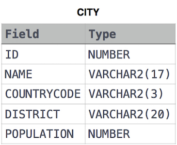
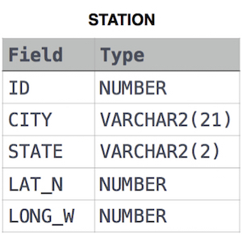

# SQL
Solutions for the tasks located at: https://www.hackerrank.com/domains/sql

## CITY table used for all below


### Revising the Select Query I
Query all columns for all American cities in the CITY table with populations larger than 100000. The CountryCode for America is USA.
```sql
SELECT * FROM city WHERE countrycode = 'USA' AND population > 100000;
```

### Revising the Select Query II
Query the NAME field for all American cities in the CITY table with populations larger than 120000. The CountryCode for America is USA.
```sql
SELECT name FROM city WHERE countrycode = 'USA' AND population > 120000;
```

### Select All
Query all columns (attributes) for every row in the CITY table.
```sql
SELECT * FROM city;
```

### Select By ID
Query all columns for a city in CITY with the ID 1661.
```sql
SELECT * FROM city WHERE id = 1661;
```

### Japanese Cities' Attributes
Query all attributes of every Japanese city in the CITY table. The COUNTRYCODE for Japan is JPN.
```sql
SELECT * FROM city WHERE countrycode = 'JPN';
```

### Japanese Cities' Names
Query the names of all the Japanese cities in the CITY table. The COUNTRYCODE for Japan is JPN.
```sql
SELECT name FROM city WHERE countrycode = 'JPN';
```


## STATION table used for all below


### Weather Observation Station 1
Query a list of CITY and STATE FROM the STATION table.
```sql
SELECT city, state FROM station;
```

### Weather Observation Station 2
Query the following two values FROM the STATION table:

The sum of all values in LAT_N rounded to a scale of  decimal places.
The sum of all values in LONG_W rounded to a scale of  decimal places.
```sql
/* mysql */
SELECT round(sum(LAT_N), 2), round(sum(LONG_W), 2) FROM station;
```

### Weather Observation Station 3
Query a list of CITY names FROM STATION for cities that have an even ID number. Print the results in any order, but exclude duplicates FROM the answer.
```sql
SELECT DISTINCT city FROM station WHERE id % 2 = 0;
```

### Weather Observation Station 4
Find the difference between the total number of CITY entries in the table and the number of distinct CITY entries in the table.
```sql
SELECT COUNT(city) - COUNT(DISTINCT city) FROM station;
```

### Weather Observation Station 5
Query the two cities in STATION with the shortest and longest CITY names, as well as their respective lengths (i.e.: number of characters in the name). If there is more than one smallest or largest city, choose the one that comes first when ordered alphabetically.
```sql
-- mysql
SELECT city, LENGTH(city) AS name_length
FROM (
    -- Shortest city name
    SELECT city, LENGTH(city) AS name_length
    FROM station
    ORDER BY LENGTH(city) ASC, city ASC
    LIMIT 1
) AS shortest

UNION ALL

SELECT city, LENGTH(city) AS name_length
FROM (
    -- Longest city name
    SELECT city, LENGTH(city) AS name_length
    FROM station
    ORDER BY LENGTH(city) DESC, city ASC
    LIMIT 1
) AS longest;
```

###

```sql
-- mysql

```

###

```sql
-- mysql

```

###

```sql
-- mysql

```

###

```sql
-- mysql

```

###

```sql
-- mysql

```

###

```sql
-- mysql

```

###

```sql
-- mysql

```

###

```sql
-- mysql

```

###

```sql
-- mysql

```

###

```sql
-- mysql

```

###

```sql
-- mysql

```

###

```sql
-- mysql

```
