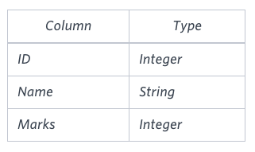
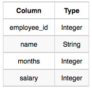
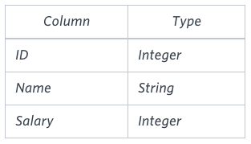

# SQL
Solutions for the tasks located at: https://www.hackerrank.com/domains/sql

## CITY table used for all below


### Revising the Select Query I
Query all columns for all American cities in the CITY table with populations larger than 100000. The CountryCode for America is USA.
```sql
SELECT * FROM city WHERE countrycode = 'USA' AND population > 100000;
```

### Revising the Select Query II
Query the NAME field for all American cities in the CITY table with populations larger than 120000. The CountryCode for America is USA.
```sql
SELECT name FROM city WHERE countrycode = 'USA' AND population > 120000;
```

### Select All
Query all columns (attributes) for every row in the CITY table.
```sql
SELECT * FROM city;
```

### Select By ID
Query all columns for a city in CITY with the ID 1661.
```sql
SELECT * FROM city WHERE id = 1661;
```

### Japanese Cities' Attributes
Query all attributes of every Japanese city in the CITY table. The COUNTRYCODE for Japan is JPN.
```sql
SELECT * FROM city WHERE countrycode = 'JPN';
```

### Japanese Cities' Names
Query the names of all the Japanese cities in the CITY table. The COUNTRYCODE for Japan is JPN.
```sql
SELECT name FROM city WHERE countrycode = 'JPN';
```

### Average Population
Query the average population for all cities in CITY, rounded down to the nearest integer.
```sql
-- mysql
SELECT FLOOR(AVG(population)) AS average_population
FROM CITY;
```

### Japan Population
Query the sum of the populations for all Japanese cities in CITY. The COUNTRYCODE for Japan is JPN.
```sql
-- mysql
SELECT SUM(population)
FROM CITY
WHERE countrycode = 'JPN';
```

### Population Density Difference
Query the difference between the maximum and minimum populations in CITY.
```sql
-- mysql
SELECT (MAX(population) - MIN(population))
FROM CITY;
```


## STATION table used for all below


### Weather Observation Station 1
Query a list of CITY and STATE FROM the STATION table.
```sql
SELECT city, state FROM station;
```

### Weather Observation Station 2
Query the following two values FROM the STATION table:

The sum of all values in LAT_N rounded to a scale of  decimal places.
The sum of all values in LONG_W rounded to a scale of  decimal places.
```sql
/* mysql */
SELECT ROUND(SUM(LAT_N), 2), ROUND(SUM(LONG_W), 2) FROM station;
```

### Weather Observation Station 3
Query a list of CITY names FROM STATION for cities that have an even ID number. Print the results in any order, but exclude duplicates FROM the answer.
```sql
SELECT DISTINCT city FROM station WHERE id % 2 = 0;
```

### Weather Observation Station 4
Find the difference between the total number of CITY entries in the table and the number of distinct CITY entries in the table.
```sql
SELECT COUNT(city) - COUNT(DISTINCT city) FROM station;
```

### Weather Observation Station 5
Query the two cities in STATION with the shortest and longest CITY names, as well as their respective lengths (i.e.: number of characters in the name). If there is more than one smallest or largest city, choose the one that comes first when ordered alphabetically.
```sql
-- mysql
SELECT city, LENGTH(city) AS name_length
FROM (
    -- Shortest city name
    SELECT city, LENGTH(city) AS name_length
    FROM station
    ORDER BY LENGTH(city) ASC, city ASC
    LIMIT 1
) AS shortest

UNION ALL

SELECT city, LENGTH(city) AS name_length
FROM (
    -- Longest city name
    SELECT city, LENGTH(city) AS name_length
    FROM station
    ORDER BY LENGTH(city) DESC, city ASC
    LIMIT 1
) AS longest;
```

### Weather Observation Station 6
Query the list of CITY names starting with vowels (i.e., a, e, i, o, or u) from STATION. Your result cannot contain duplicates.
```sql
-- mysql
SELECT DISTINCT city FROM station WHERE (city LIKE 'a%' OR city LIKE 'e%' OR city LIKE 'i%' OR city LIKE 'o%' OR city LIKE 'u%');
```

### Weather Observation Station 7
Query the list of CITY names ending with vowels (a, e, i, o, u) from STATION. Your result cannot contain duplicates.
```sql
-- mysql
SELECT DISTINCT city
FROM station
WHERE city REGEXP '[aeiouAEIOU]$';
```

### Weather Observation Station 8
Query the list of CITY names from STATION which have vowels (i.e., a, e, i, o, and u) as both their first and last characters. Your result cannot contain duplicates.
```sql
-- mysql
SELECT DISTINCT city
FROM station
WHERE city REGEXP '^[aeiouAEIOU].*[aeiouAEIOU]$';
```

### Weather Observation Station 9
Query the list of CITY names from STATION that do not start with vowels. Your result cannot contain duplicates.
```sql
-- mysql
SELECT DISTINCT city
FROM station
WHERE NOT city REGEXP '^[aeiouAEIOU]';
```

### Weather Observation Station 10
Query the list of CITY names from STATION that do not end with vowels. Your result cannot contain duplicates.
```sql
-- mysql
SELECT DISTINCT city
FROM station
WHERE NOT city REGEXP '[aeiouAEIOU]$';
```

### Weather Observation Station 11
Query the list of CITY names from STATION that either do not start with vowels or do not end with vowels. Your result cannot contain duplicates.
```sql
-- mysql
SELECT DISTINCT city
FROM station
WHERE NOT city REGEXP '^[aeiouAEIOU].*[aeiouAEIOU]$';
```

### Weather Observation Station 12
Query the list of CITY names from STATION that do not start with vowels and do not end with vowels. Your result cannot contain duplicates.
```sql
-- mysql
SELECT DISTINCT city
FROM station
WHERE NOT (city REGEXP '^[aeiouAEIOU]' OR city REGEXP '[aeiouAEIOU]$');
```

### Weather Observation Station 13
Query the sum of Northern Latitudes (LAT_N) from STATION having values greater than 38.7880 and less than 137.2345. Truncate your answer to  4 decimal places.
```sql
-- mysql
SELECT ROUND(SUM(LAT_N), 4)
FROM station
WHERE LAT_N > 38.7880 AND LAT_N < 137.2345;
```

### Weather Observation Station 14
Query the greatest value of the Northern Latitudes (LAT_N) from STATION that is less than 137.2345. Truncate your answer to 4 decimal places.
```sql
-- mysql
SELECT ROUND(LAT_N, 4)
FROM station
WHERE LAT_N < 137.2345
ORDER BY LAT_N DESC
LIMIT 1;
```

### Weather Observation Station 15
Query the Western Longitude (LONG_W) for the largest Northern Latitude (LAT_N) in STATION that is less than 137.2345. Round your answer to 4 decimal places.
```sql
-- mysql
SELECT ROUND(LONG_W, 4)
FROM station
WHERE LAT_N < 137.2345
ORDER BY LAT_N DESC
LIMIT 1;
```

### Weather Observation Station 16
Query the smallest Northern Latitude (LAT_N) from STATION that is greater than 38.7880. Round your answer to 4 decimal places.
```sql
-- mysql
SELECT ROUND(LAT_N, 4)
FROM station
WHERE LAT_N > 38.7880
ORDER BY LAT_N ASC
LIMIT 1;
```

### Weather Observation Station 17
Query the Western Longitude (LONG_W) where the smallest Northern Latitude (LAT_N) in STATION that is greater than 38.7880. Round your answer to 4 decimal places.
```sql
-- mysql
SELECT ROUND(LONG_W, 4)
FROM station
WHERE LAT_N > 38.7880
ORDER BY LAT_N ASC
LIMIT 1;
```

### Weather Observation Station 18
Consider P1(a, b) and P2(c,d) to be two points on a 2D plane.
- a - happens to equal the minimum value in Northern Latitude (LAT_N in STATION).
- b - happens to equal the minimum value in Western Longitude (LONG_W in STATION).
- c - happens to equal the maximum value in Northern Latitude (LAT_N in STATION).
- d - happens to equal the maximum value in Western Longitude (LONG_W in STATION).

Query the Manhattan Distance between points P1 and P2 and round it to a scale of 4 decimal places.
```sql
-- mysql
SELECT
    ROUND(
        ABS(MIN(LAT_N) - MAX(LAT_N)) + ABS(MIN(LONG_W) - MAX(LONG_W)),
        4
    ) AS manhattan_distance
FROM
    station;
```

### Weather Observation Station 19
Consider P1(a, c) and P2(b, d) to be two points on a 2D plane where (a,b) are the respective minimum and maximum values of Northern Latitude (LAT_N) and (c, d) are the respective minimum and maximum values of Western Longitude (LONG_W) in STATION.
Query the Euclidean Distance between points P1 and P2 and round it to a scale of 4 decimal places.
```sql
-- mysql
SELECT
    ROUND(
        SQRT(POW(MIN(LAT_N) - MAX(LAT_N), 2) + POW(MIN(LONG_W) - MAX(LONG_W), 2)),
        4
    ) AS euclidean_distance
FROM
    station;
```

### Weather Observation Station 20
A median is defined as a number separating the higher half of a data set from the lower half. Query the median of the Northern Latitudes (LAT_N) from STATION and round your answer to 4 decimal places.
```sql
-- mysql
WITH OrderedLatitudes AS (
    SELECT LAT_N
    FROM station
    ORDER BY LAT_N
),
RowNumbered AS (
    SELECT LAT_N, ROW_NUMBER() OVER () AS row_num
    FROM OrderedLatitudes
),
Counted AS (
    SELECT COUNT(*) AS total_count
    FROM station
)
SELECT ROUND(
    CASE
        -- Odd number of records: pick the middle value
        WHEN total_count % 2 = 1 THEN
            (SELECT LAT_N FROM RowNumbered WHERE row_num = (total_count + 1) / 2)
        -- Even number of records: average the two middle values
        ELSE
            (SELECT AVG(LAT_N)
             FROM RowNumbered
             WHERE row_num IN (total_count / 2, total_count / 2 + 1))
    END,
    4
) AS median_lat_n
FROM Counted;
```


## STUDENTS table used for all below



### Higher Than 75 Marks
Query the Name of any student in STUDENTS who scored higher than 75 Marks. Order your output by the last three characters of each name. If two or more students both have names ending in the same last three characters (i.e.: Bobby, Robby, etc.), secondary sort them by ascending ID.
```sql
-- mysql
SELECT Name
FROM STUDENTS
WHERE Marks > 75
ORDER BY RIGHT(Name, 3), ID ASC;
```


## EMPLOYEE table used for all below


### Employee Names
Write a query that prints a list of employee names (i.e.: the name attribute) from the Employee table in alphabetical order.
```sql
-- mysql
SELECT name
FROM EMPLOYEE
ORDER BY name;
```

### Employee Salaries
Write a query that prints a list of employee names (i.e.: the name attribute) for employees in Employee having a salary greater than $2000 per month who have been employees for less than 10 months. Sort your result by ascending employee_id.
```sql
-- mysql
SELECT name
FROM EMPLOYEE
WHERE salary > 2000 AND months < 10
ORDER BY employee_id ASC;
```

### Top Earners
We define an employee's total earnings to be their monthly `salary x months` worked, and the maximum total earnings to be the maximum total earnings for any employee in the Employee table. Write a query to find the maximum total earnings for all employees as well as the total number of employees who have maximum total earnings. Then print these values as `2` space-separated integers.
```sql
-- mysql
SELECT
    MAX(salary * months) AS max_total_earnings,
    COUNT(*) AS num_employees
FROM EMPLOYEE
WHERE salary * months = (
    SELECT MAX(salary * months) FROM EMPLOYEE
);
```


## EMPLOYEES table used for all below


### The Blunder
Samantha was tasked with calculating the average monthly salaries for all employees in the EMPLOYEES table, but did not realize her keyboard's 0 key was broken until after completing the calculation. She wants your help finding the difference between her miscalculation (using salaries with any zeros removed), and the actual average salary.
Write a query calculating the amount of error (i.e.: `actual - miscalculated` average monthly salaries), and round it up to the next integer.
```sql
-- mysql
SELECT CEIL(AVG(Salary) - AVG(CAST(REPLACE(Salary, '0', '') AS UNSIGNED))) AS error
FROM EMPLOYEES;
```


###

```sql
-- mysql

```

###

```sql
-- mysql

```
